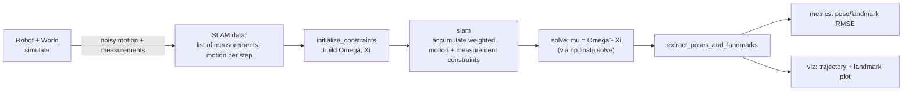
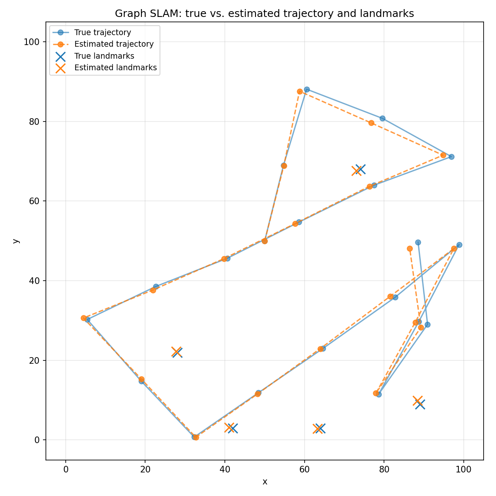

# 2D Graph SLAM: Landmark Detection and Robot Tracking


A from-scratch implementation of Graph SLAM (Simultaneous Localization and
Mapping): given only a robot's noisy motion commands and noisy landmark
measurements over time, reconstruct the robot's full trajectory and the
positions of every landmark, with no access to ground truth at any point.

**What this demonstrates:** building and solving a sparse linear
least-squares system (the information-matrix / "Graph SLAM" formulation of
SLAM) from a stream of noisy relative measurements, correctly handling
under-constrained/singular cases, and validating the result against both
hand-derived analytic solutions and ground truth from simulation.

## Problem statement

A robot moves through a bounded 2D world in a straight line, occasionally
changing heading when it would hit a wall. At each time step it senses the
(x, y) offset to every landmark within its measurement range. Both motion and
measurement are corrupted by noise. Using *only* this noisy stream, `slam()`
estimates the robot's pose at every time step and the position of every
landmark — a maximum-likelihood estimate of the full trajectory and map,
computed in a single batch solve.

## Architecture / data flow



## Features

- `Robot` simulation: straight-line motion with wall collisions, noisy
  landmark sensing within a configurable range, reproducible via a seeded
  RNG (`graph_slam/robot.py`)
- Synthetic world/trajectory generator that also records ground truth for
  evaluation, not just the SLAM input stream (`graph_slam/world.py`)
- Graph SLAM constraint construction and solver, using `numpy.linalg.solve`
  rather than an explicit matrix inverse, with explicit detection of
  under-constrained systems (`graph_slam/constraints.py`, `graph_slam/solver.py`)
- Pose/landmark error metrics against ground truth (`graph_slam/metrics.py`)
- Trajectory/landmark comparison plotting (`graph_slam/viz.py`)
- A one-command CLI demo (`graph_slam/cli.py`)
- 45 passing `pytest` tests, including a fully hand-derived analytic case
- GitHub Actions CI running the test suite on Python 3.10 and 3.12

## Repository layout

```
graph_slam/            # the package
├── robot.py            # Robot: move(), sense(), landmark placement
├── world.py            # simulate(): synthetic world + ground truth
├── constraints.py       # initialize_constraints(): build Omega, Xi
├── solver.py            # slam(): accumulate constraints, solve for mu
├── metrics.py            # pose/landmark RMSE, final pose error
├── viz.py                 # trajectory/landmark comparison plot
└── cli.py                  # `graph-slam-demo` command-line entry point
tests/                  # pytest suite (45 tests)
notebooks/
└── demo.ipynb           # interactive walkthrough (new notebook, see note below)
docs/
├── example_trajectory.png   # figure from the reproducible example below
└── metrics.json              # metrics from the same run
archive/                # original Udacity submission, preserved as-is (see archive/README.md)
```

## Installation

```bash
git clone https://github.com/adebowalep/graph-slam-2d-landmark-tracking.git
cd graph-slam-2d-landmark-tracking

python3 -m venv .venv
source .venv/bin/activate    # Windows: .venv\Scripts\activate

pip install -e ".[dev]"
```

Verified with Python 3.12.7 and 3.9 dependency floor (`numpy>=1.24`,
`matplotlib>=3.7`); CI additionally runs on 3.10.

## One-command demo

```bash
graph-slam-demo --seed 42 --steps 20 --num-landmarks 5 --output-dir results
```

This simulates a world, runs `slam()`, prints error metrics, and writes
`results/trajectory.png` and `results/metrics.json`. Run
`graph-slam-demo --help` for all options (world size, measurement range,
motion/measurement noise, step distance).

There's also an interactive version: `jupyter notebook notebooks/demo.ipynb`.

## Running tests

```bash
pytest -v
```

45 tests covering robot motion/boundaries/sensing, constraint-matrix
dimensions and symmetry, a hand-derived analytic SLAM example, invalid-input
handling, under-constrained-system detection, and a seeded end-to-end run
checked against numerical tolerances (not exact values, since it's a random
simulation).

## Reproducible example result

```bash
graph-slam-demo --seed 42 --steps 20 --num-landmarks 5 --world-size 100 \
  --measurement-range 50 --motion-noise 2.0 --measurement-noise 2.0 --distance 20 \
  --output-dir docs
```



| Metric | Value | Definition |
|---|---|---|
| Pose RMSE | 1.419 | root-mean-square Euclidean distance between estimated and true pose, over all 20 time steps |
| Landmark RMSE | 0.889 | root-mean-square Euclidean distance between estimated and true landmark position, over all 5 landmarks |
| Final pose error | 2.666 | Euclidean distance between the estimated and true pose at the last time step |

(Full numbers in [`docs/metrics.json`](docs/metrics.json), generated by the exact command above.)

In the figure, the blue trajectory/x's are ground truth (only known because
this is a simulation) and the orange trajectory/x's are what `slam()`
recovered from *only* the noisy motion/measurement stream. The first pose is
always recovered essentially exactly, because it's the anchor point the whole
system is solved relative to (see "The math," below); the estimated
trajectory then tracks the true one closely, with the largest visible gaps
occurring where a tight sequence of turns compounds motion noise before the
next landmark re-observation corrects it.

## The math

Graph SLAM turns every motion and measurement into a linear constraint, then
solves for all unknowns (every robot pose and every landmark position) at
once via least squares.

- **State vector `mu`**: `[P0x, P0y, P1x, P1y, ..., L0x, L0y, L1x, L1y, ...]`
  — the (x, y) position of the robot at every time step, followed by the
  (x, y) position of every landmark. Length `2*(N + L)` for `N` poses and
  `L` landmarks.
- **Omega (`Ω`)**: a `2(N+L) × 2(N+L)` matrix of relative confidences
  between pairs of variables in `mu` — how strongly two entries are tied
  together by the data.
- **Xi (`ξ`)**: a `2(N+L)`-length vector accumulating the weighted evidence
  for each variable.
- **Motion constraint**: each motion `(dx, dy)` between pose `t` and pose
  `t+1` says "pose `t+1` ≈ pose `t` + `(dx, dy)`". This adds weight
  `1/motion_noise` to the diagonal entries for both poses, `-1/motion_noise`
  to their off-diagonal cross-term, and `∓dx/motion_noise`, `∓dy/motion_noise`
  to the corresponding entries of `ξ`.
- **Measurement constraint**: each sensed `(dx, dy)` from pose `t` to
  landmark `i` says "landmark `i` ≈ pose `t` + `(dx, dy)`", updating `Ω` and
  `ξ` the same way, weighted by `1/measurement_noise`.
- **Anchoring**: the robot's starting pose is pinned to the center of the
  world with full confidence (`Ω[0,0] = Ω[1,1] = 1`). Without this, the
  system only knows *relative* positions and is singular — anchoring one
  pose fixes the overall coordinate frame (a standard technique sometimes
  called "gauge fixing").
- **Solve**: `mu = Ω⁻¹ξ`, computed here as `numpy.linalg.solve(omega, xi)`
  rather than an explicit inverse — mathematically equivalent for a
  well-posed system, but avoids forming a full matrix inverse.

Every landmark must be observed by at least one measurement, directly or
through a chain of measurements and motions connecting it to the rest of the
graph, or its rows/columns in `Ω` stay all zero and the system is singular.
`slam()` detects this before attempting to solve and raises
`UnderconstrainedSystemError` naming the unobserved landmark(s), rather than
surfacing a cryptic `numpy.linalg.LinAlgError` or (worse) a wrong answer from
a near-singular solve.

## Limitations

- **Simplified sensor model.** The robot senses (x, y) offsets directly, not
  the range-and-bearing measurements typical of real sensors (LIDAR, sonar,
  cameras). This is inherited from the original course problem and keeps the
  math linear; a real-world sensor model would need a nonlinear formulation
  (EKF-SLAM or nonlinear least squares).
- **Simulated environment only.** There's no real sensor data, no dynamic
  obstacles, and no sensor model beyond simple Gaussian-ish additive noise
  applied to true (x, y) offsets — this is a controlled environment for
  studying the SLAM math, not a robotics-hardware pipeline.
- **Noise is a scale parameter, not a calibrated distribution.** `rand()`
  draws uniformly on `[-1, 1)`; `motion_noise`/`measurement_noise` scale that
  draw. The `1/noise` weighting in `Ω`/`ξ` treats this as if it were an
  inverse-variance (information) weight, which is an approximation, not an
  exact maximum-likelihood weighting for uniform noise.
- **No outlier rejection.** A single bad measurement affects the whole batch
  solve; there's no robust loss (e.g. Huber) and no RANSAC-style rejection.
- **Dense batch solver.** `Ω` is treated as a dense `numpy` array and solved
  in one shot. This is fine at the scale used here (tens of poses/landmarks)
  but doesn't scale to real SLAM problem sizes (thousands+ of poses/landmarks),
  where sparse solvers and incremental (not batch) updates are required.
- **No data association.** Landmark identity is given directly by the
  simulator (`landmark_index` in each measurement); there's no landmark
  re-identification from unlabeled sensor readings.

## Project origin

This started as the "Implement SLAM" project in Udacity's Computer Vision
Nanodegree. Udacity supplied the robot simulator skeleton, the
`helpers.make_data` world/data generator, the notebook scaffolding, and the
mathematical problem statement (the constraint-matrix formulation of Graph
SLAM); the original submission — robot_class.py's `sense()` function and
Notebook 3's `initialize_constraints`/`slam` implementation — was completed
independently against that problem statement, not copied from a reference
solution (verified during this refactor against a hand-derived analytic
example and an independently-coded decoupled x/y solver, both of which agree
exactly).

Everything in this repository outside `archive/` — the `graph_slam` package,
the constraint/solver correctness fixes (linear solve instead of explicit
inverse, explicit under-constrained-system detection), the metrics module,
the test suite, the CLI, and this README — was built independently for this
portfolio refactor. The original submission is preserved unmodified in
[`archive/`](archive/README.md) for provenance.

The repository's MIT license (in [`LICENSE`](LICENSE)) originates from
Udacity's starter repository and covers the whole project, consistent with
how Udacity distributes this project's starter code.

## License

MIT — see [LICENSE](LICENSE).
